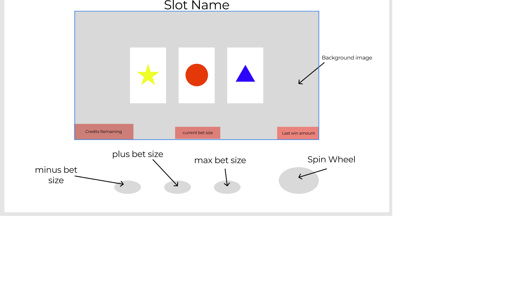
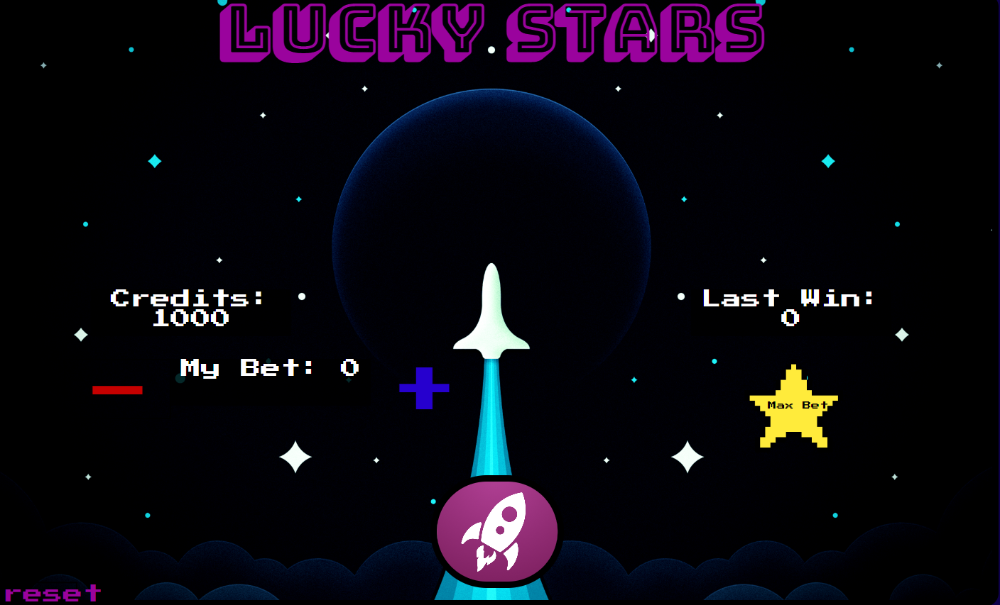

# 🚀 Lucky Stars Slot Machine 🌟

## Background

Welcome to the Lucky Stars Slot Machine, where the cosmos aligns with your luck! Brace yourself for an intergalactic gambling adventure like no other.

Visit the game [here](https://zfidz.github.io/Lucky-Stars-Slot-Machine/)

## Game Rules

Prepare for an astronomical experience! Embark on your cosmic journey by pressing the + or - buttons to soar higher or descend lower with your bets. If you're feeling particularly daring, unleash the power of the "Max Bet" star and wager all your credits in a single magnificent gamble.

Once you've set your course, ignite the engines and press the "Launch" button to send the reels into a mesmerizing spin. But beware, for the universe can be both generous and merciless.

Remember, when your credits fall to zero, your space odyssey will come to a screeching halt. Choose your bets wisely, for the stars hold both fortune and fate.

## Winning Combos
- 💫 **3x Astronauts** = 4 times the size of your bet ✨
- 🚀 **3x Rockets** = 6 times the size of your bet 🌠
- 🪐 **3x Saturns** = 10 times the size of your bet 🌌

## Wireframe

Behold the blueprint of cosmic perfection:

## Screenshot

Witness the enchantment of the celestial reels:

## Future Considerations

- Unleash the true power of the cosmos by adding mesmerizing animations to the slots, bringing the universe to life with each spin.
- Expand the celestial canvas with additional reels and a myriad of captivating symbols, multiplying your chances for astronomical wins.
- Embark on a daring adventure with enhanced betting options, allowing you to explore different dimensions of risk and reward.
- Immerse yourself fully in the cosmic symphony by adding celestial sound effects, taking your senses on a captivating voyage through space and time.

 ## Planning
 
spinWheel function () {
setTimeout between showing each individual symbol
chosen from randomize function
}

winConditions function() {
if symbols land on "X" "X" "X" then player will win a set multiplier times the amount bet
}
if player hits certain combo ex.(7,7,7,) display JACKPOT!

randomize function() {
on button clicked randomize symbol( math.floor math.random)
}

setBet function() {
when bet button clicked, set amount bet on slot machine_- and a +.
make max bet total available in credits remaining
}

creditsRemaining function() {
set player has "x" amount to start. When bet is set, 
deduct from player amount,
once player hits 0, game over.
}
